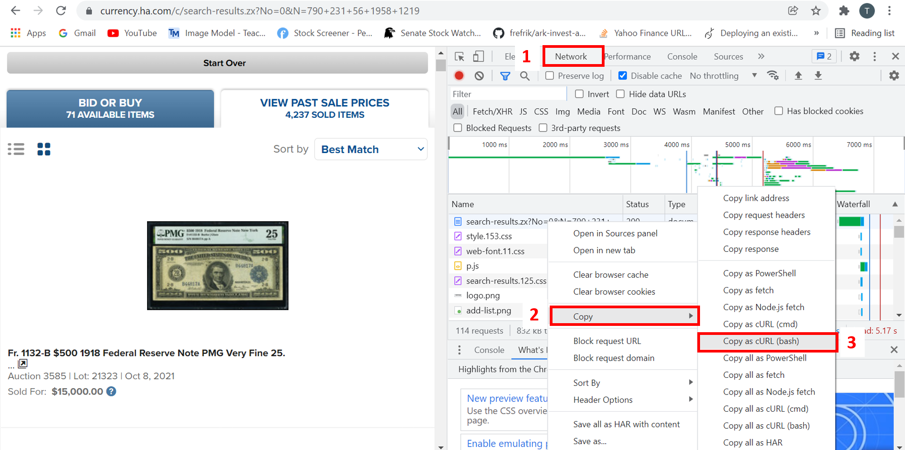
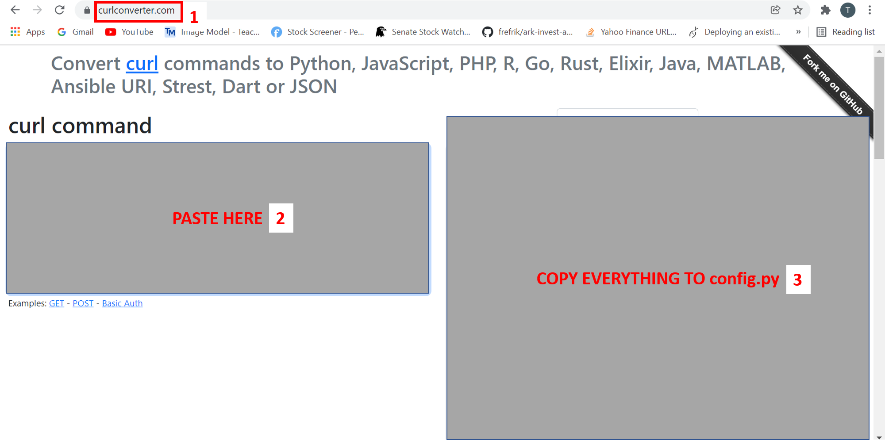

# Heritage Auctions Currency Scraper


## Setting Up
- Clone:
```
git clone https://github.com/spartan737/HeritageAuctions_Currency_Scraper.git
```

- Install packages:
```
pip install -r requirements.txt
```

- Login into https://currency.ha.com/ first
- Copy Requests and Cookies from website


- Convert Requests and Cookies to Python format in https://curlconverter.com/


- Paste output to config.py

### Run Script
- Follow the parameters:
```
python scraper.py --output_filename [output csv name] --denominator [100/500/1000]
```

- For example:
```
python scraper.py --output_filename denominator_1000.csv --denominator 1000
```